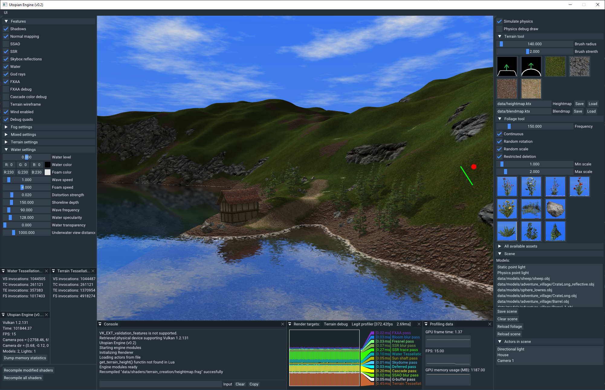
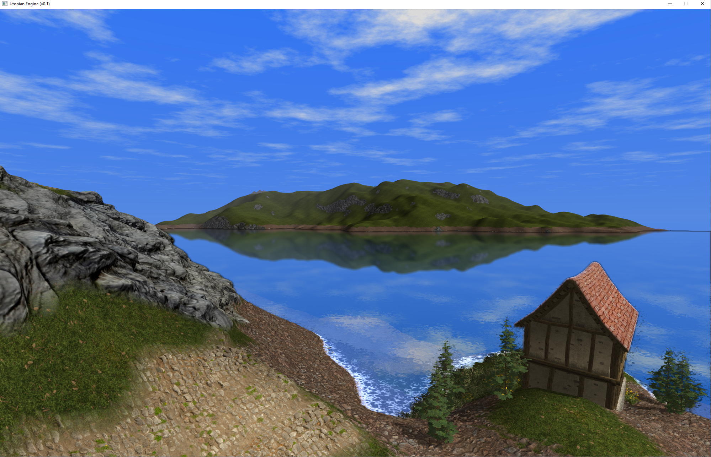
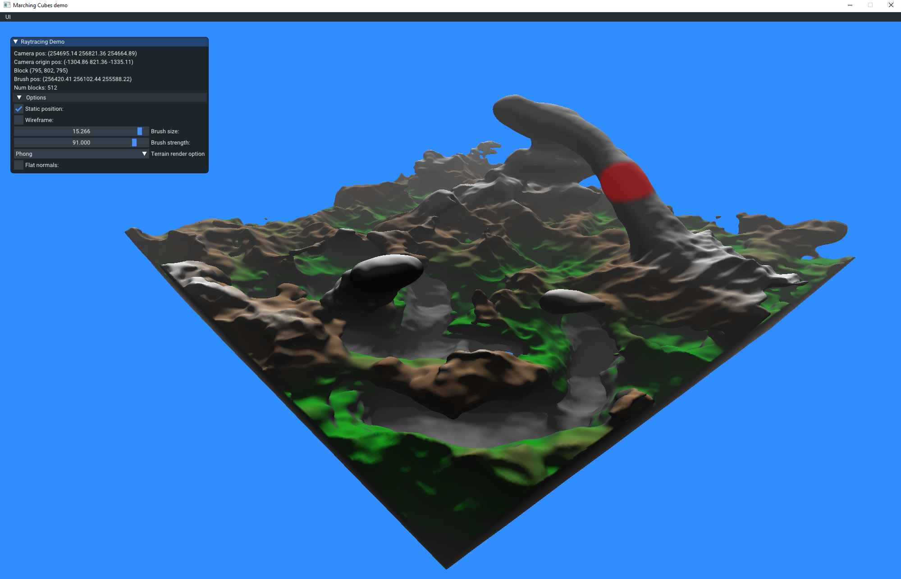

# Utopian Engine

This project is developed to learn how renderers and game engine works as well as acting as a base for research/experimentation. The intention is to make my own games using it and also once more mature make it convenient for others to use as well.

It is written C++ and uses Vulkan as the rendering API.

## Media

## Features
+ Vulkan backend
+ Deferred shading
+ Casacade shadow mapping
+ Screen Space Reflections
+ Normal mapping
+ God rays
+ SSAO
+ Instancing
+ Runtime shader compilation
+ Shader reflection
+ Basic Lua scripting
+ Terrain generation
+ Skydome with sun
+ ImGui user interface
+ ECS layer
+ Terrain tesselation
+ Displacement mapping
+ Water

## Planned features
+ Atmospheric scattering
+ HDR
+ Particle systems
+ LOD
+ Clouds

## Building

Currently the engine only runs on Windows.

Run the `generate_workspace.bat` script to generate a Visual Studio 2019 solution.
If you want to generate a solution for another VS version run `tools/premake5.exe` manually.

Pre compiled libraries for MSVC x64 Debug are included in the `libs/` folder.

## Folder structure

| Folder            | Description                                                |
|-------------------|------------------------------------------------            |
| source/utopian/   | Utopian Engine source code                                 |
| source/editor/    | Editor source code                                         |
| source/demos/marching_cubes/ | [A demo using marching cubes to generate a modifiable terrain](https://github.com/simplerr/UtopianEngine/tree/master/source/demos/marching_cubes) |
| source/demos/raytracing/ | [A simple compute shader raytracer](https://github.com/simplerr/UtopianEngine/tree/master/source/demos/raytracing) |
| external/         | Third party submodules and .h files                        |
| libs/             | Pre compiled third party dependencies                      |
| data/             | Textures, models, shaders, scenes etc.                     |
| tools/            | Tools and scripts                                          |

## Thrid party dependencies

| Library                                                      | Usage                                                      |
|--------------------------------------------------------------|------------------------------------------------------------|
| [gli](https://github.com/g-truc/gli)                         | Loading of .ktx textures                                   |
| [assimp](https://github.com/assimp/assim)                    | Loading of model files                                     |
| [bullet](https://github.com/bulletphysics/bullet3)           | Physics simulation                                         |
| [glslang](https://github.com/KhronosGroup/glslang)           | Compilation and reflection of shaders                      |
| [im3d](https://github.com/john-chapman/im3d)                 | Immediate mode 3D gizmos in editor                         |
| [imgui](https://github.com/ocornut/imgui)                    | Editor UI                                                  |
| [LegitProfiler](https://github.com/Raikiri/LegitProfiler)    | Profiler to visualize GPU performance                      |
| [LuaPlus](https://github.com/jjensen/luaplus51-all)          | Lua binding to enable scripting                            |
| [stb](https://github.com/nothings/stb)                       | Loading of textures                                        |
| [libktx](https://github.com/KhronosGroup/KTX-Software)       | Creation and saving of .ktx texture to file                |
